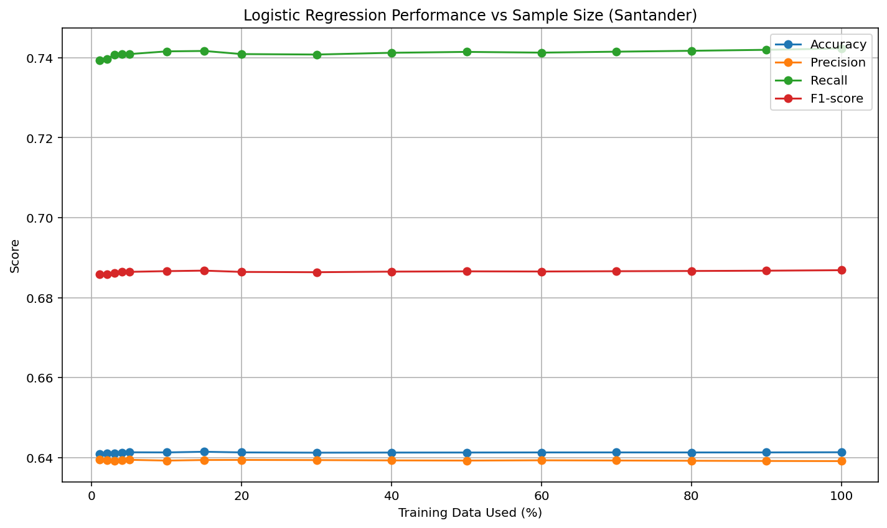
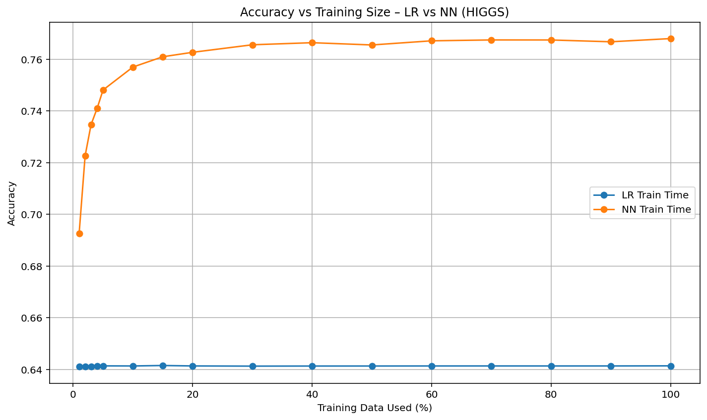
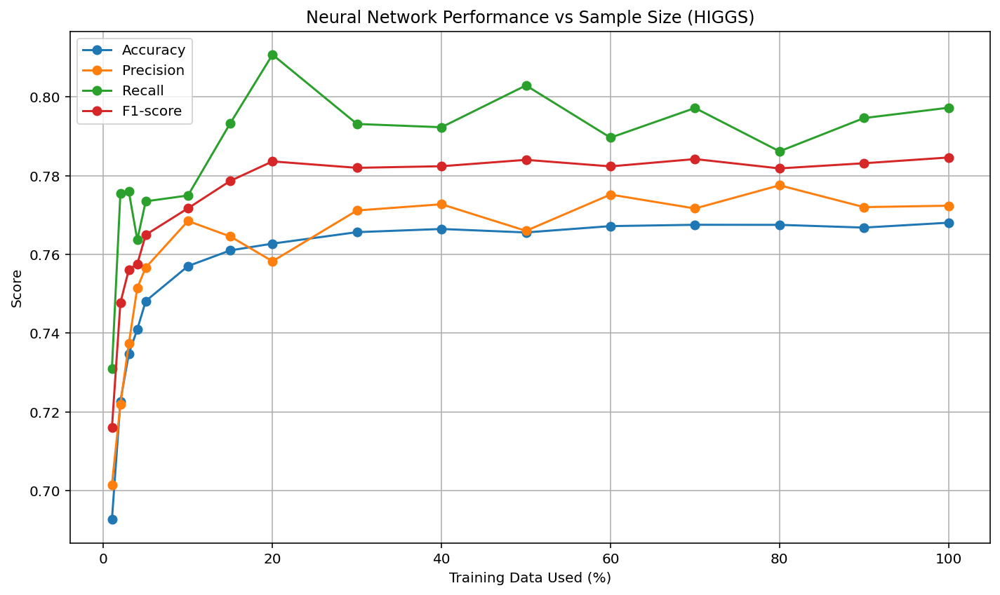
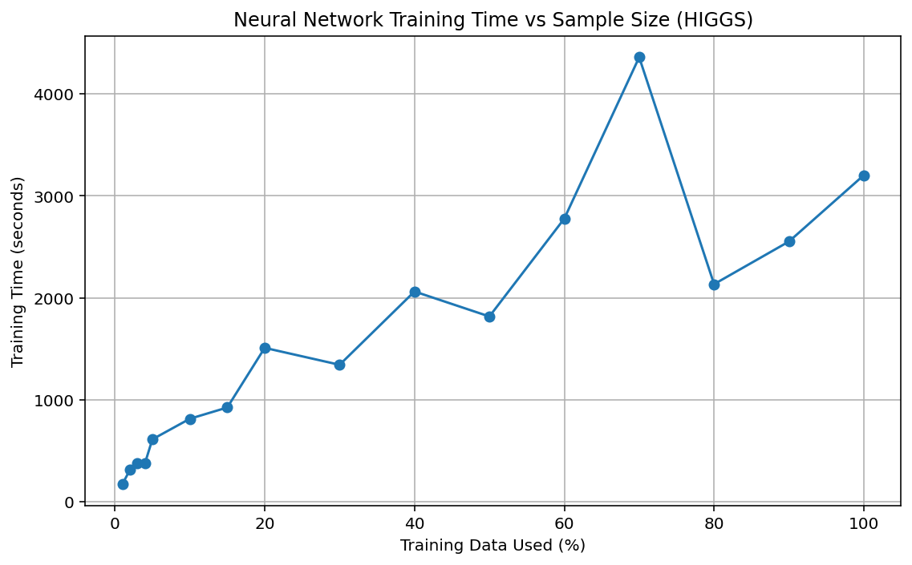
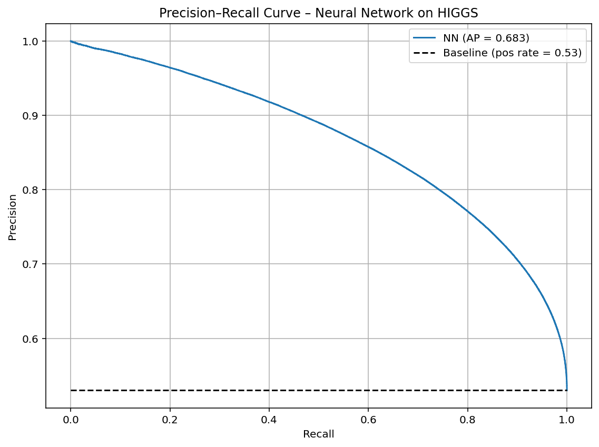
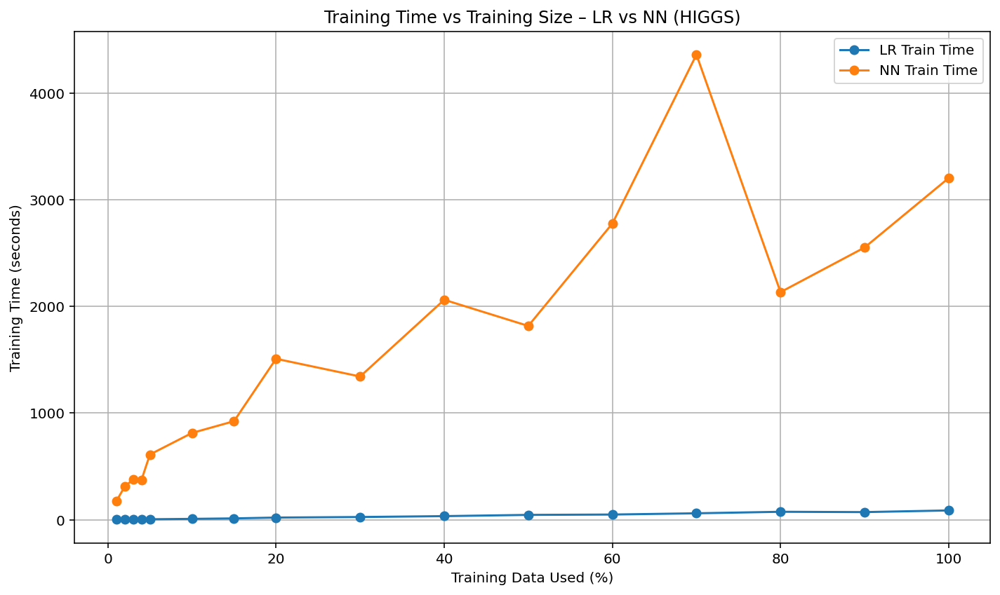

# 📘 HIGGS Dataset – Machine Learning Classification  
### Logistic Regression vs Neural Network (MLP) Comparative Study


---

## 📌 Overview

This project presents a **full end-to-end machine learning pipeline** applied to the **HIGGS Dataset (11 million samples)** — a highly complex, real scientific dataset used in particle physics experiments.

The goal is to compare:

- **Logistic Regression (LR)**
- **Neural Network (MLPClassifier)**  

across different **training sample sizes** (1% → 100%).

### 📊 We evaluate:

- Accuracy  
- Precision  
- Recall  
- F1-score  
- ROC-AUC  
- PR-AUC  
- Training Time Scaling  

---

## 📂 Project Structure

```text
HIGGS-ML-Classification/
│
├── notebooks/                     
│   ├── 01_data_loading.ipynb
│   ├── 02_preprocessing.ipynb
│   ├── 03_logistic_regression_experiments.ipynb
│   ├── 04_neural_network_experiments.ipynb
│   └── 05_full_pipeline.ipynb
│
├── src/                          
│   ├── COMPARISON OF LOGISTIC REGRESSION VS NEURAL NETWORK ON HIGGS DATASET.py
│
├── plots/                        # All generated charts and graphs
│   ├── LR_Performance_vs_Sample_Size.png
│   ├── LR_Training_Time_vs_Sample_Size.png
│   ├── ROC_Curve_LR_on_HIGGS.png
│   ├── PR_Curve_on_HIGGS.png
│   ├── NN_Performance_vs_Sample_Size.png
│   ├── NN_Training_Time_vs_ample_Size.png
│   ├── ROC_Curve_NN_on_HIGGS.png
│   ├── PR_Curve_on_NN_HIGGS.png
│   ├── Accuracy_Comparison.png
│   ├── F1_Score_Comparison.png
│   ├── Training_Time_Comparison.png
│   ├── ROC_Curve_Comparison.png
│   └── PR_Curve_Comparison.png
│
├── reports/                      # Text-format experiment outputs
│   ├── LogisticRegressionReport.txt
│   ├── NeuralNetworkReport.txt
│   └── higgs_summary.txt
│
├── README.md
└── requirements.txt
```


---

## 🧪 Dataset Description

The **HIGGS dataset** consists of simulated particle collision events used in high-energy physics.

### **Dataset Properties**
- **Total Samples:** 11,000,000  
- **Features:** 28  
- **Target:** Binary (Signal = 1, Background = 0)

### **Class Balance**
| Class | Count | Ratio |
|-------|--------|--------|
| Signal (1) | ~5.83M | 52.9% |
| Background (0) | ~5.17M | 47.1% |

The dataset is **moderately balanced**, making it ideal for ROC/PR analysis.

---

## 🧹 Preprocessing Steps

✔ Loaded 11M rows in memory  
✔ Verified no missing values  
✔ Detected duplicate rows  
✔ Applied **StandardScaler**  
✔ Split dataset using **stratified 80/20**  
✔ Generated statistical summary (`higgs_summary.txt`)

---

## 🔬 Experiment Settings

Models trained using:

1%, 2%, 3%, 4%, 5%, 10%, 15%, 20%, 30%,
40%, 50%, 60%, 70%, 80%, 90%, 100%

yaml
Copy code


Metrics computed:

- Accuracy  
- Precision  
- Recall  
- F1-score  
- Training time  
- ROC curve  
- Precision-Recall curve  

---

# 📈 Results Summary

## 🔵 Logistic Regression (Full dataset)
- **Accuracy:** 0.641  
- **F1-score:** 0.686  
- **ROC-AUC:** 0.684  
- **PR-AUC:** 0.683  
- **Training Time:** ~86 sec  

## 🟣 Neural Network (Full dataset)
- **Accuracy:** 0.768  
- **F1-score:** 0.785  
- **ROC-AUC:** 0.852  
- **PR-AUC:** 0.865  
- **Training Time:** ~3200 sec  

➡ **Neural Networks outperform LR significantly**, but LR is far faster.

---

# 📊 Visualizations

Below are the plots generated during the experiment.

---

## 📉 Logistic Regression

### **LR Performance vs Sample Size**


### **LR Training Time vs Sample Size**


### **LR ROC Curve**


### **LR PR Curve**


---

## 🤖 Neural Network

### **NN Performance vs Sample Size**


### **NN Training Time vs Sample Size**


### **NN ROC Curve**


### **NN PR Curve**


---

## 🆚 LR vs NN Comparison

### **Accuracy Comparison**


### **F1-Score Comparison**


### **Training Time Comparison**


### **ROC Curve Comparison**


### **PR Curve Comparison**


---

## 🚀 How to Run

### 1️⃣ Create Environment


conda create -n higgs python=3.13 -y
conda activate higgs

shell
Copy code

### 2️⃣ Install requirements

pip install -r requirements.txt

shell
Copy code

### 3️⃣ Launch Notebooks

jupyter notebook

yaml
Copy code

---

## 🧠 Technologies Used

- Python 3.13  
- Scikit-learn  
- Pandas  
- Matplotlib  
- NumPy  
- Jupyter Notebook  

---

## 📄 License

Distributed under the **MIT License**.

---

## 👤 Author

**Muhammad Azeem Bhatti**  
Machine Learning Engineer  
GitHub: https://github.com/MuhammadAzeemBhatti-UnityDeveloper

---
